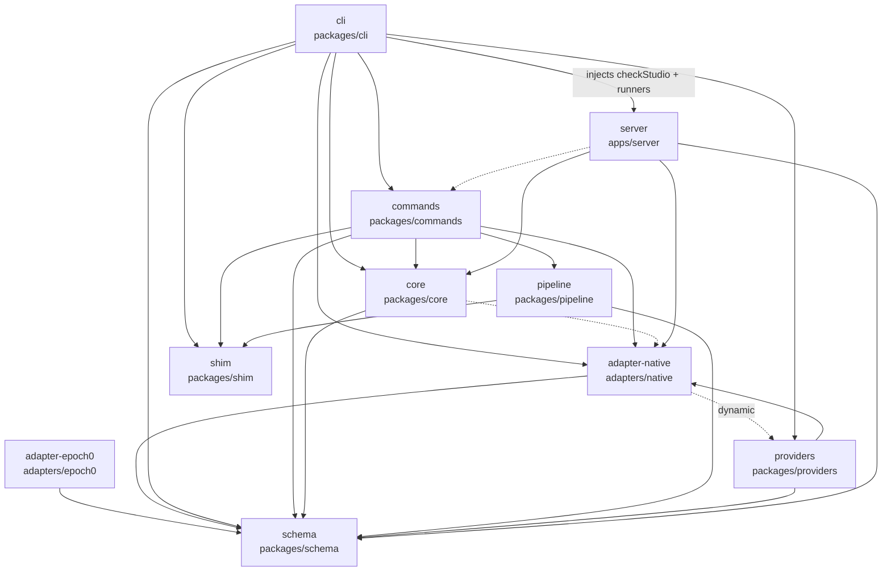
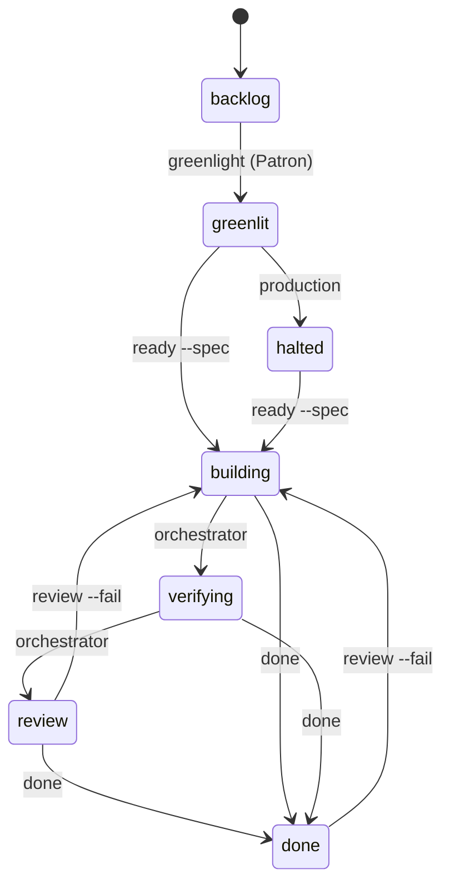
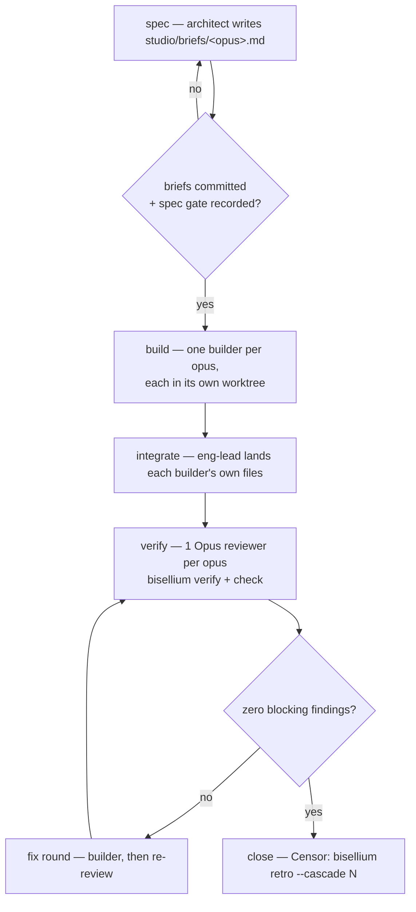
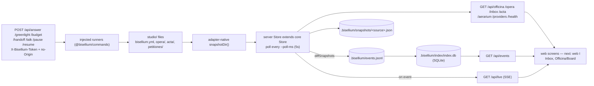

# Architecture

Four maps of Bisellium as it stands after cascade 6: what depends on what, how
an opus moves, how a cascade runs, and how a studio's files reach a screen.
A map, not a spec — the contracts live in `docs/ADOPTION.md` and the leges.

## 1. Packages

Regenerated by `scripts/arch-graph.mjs` (`node scripts/arch-graph.mjs .`), which
reads each workspace's `package.json` and scans its own `@bisellium/*` import
specifiers. Paste its stdout over the block below; its stderr reports drift
(declared-but-never-imported, imported-but-undeclared) and is not part of the
diagram.

Solid is a runtime import, dotted a deliberate dynamic `import()`
(`adapter-native` → `providers`, the one edge that would otherwise be a static
ESM cycle), dashed a dev/test-only edge — and the only `cli`↔`server` edge runs
downward: `packages/cli/src/serve.ts` passes `checkStudio` and the seven write
runners into `startServer`, so `apps/server` never imports `@bisellium/cli` or
`@bisellium/commands` at runtime (the cycle W-016 cut).

Two declared-but-unused dependencies stand today, reported by the script and
left alone here: `packages/cli` → `@bisellium/pipeline` and `apps/server` →
`@bisellium/shim`. `apps/web` has no `package.json` yet, so it is not in the
graph.

## 2. Opus lifecycle

Only four transitions have a command behind them — `greenlight` (backlog only),
`ready` (from `greenlit` or `halted`, and it refuses without a spec), `done`
(from `building`, `verifying` or `review`) and `review --fail`'s reopen edge
back to `building` from `review` or `done`; `verify` writes gate records and
never touches `state`.

The middle of the lifecycle is orchestrator-driven: nothing in the CLI moves an
opus into `verifying` or `review`, and nothing writes `halted` — `adapters/native`
names production's magister as halt's actor, and every state but `done` may halt
(drawn once, from `greenlit`, rather than six times). That gap is L-015, open.

## 3. Cascade

Four phases are fixed in `cascades/cascade.js` (`spec → build → verify → close`)
and sized by `cascades/sizing.json` (2 opera, 1 reviewer per opus, 1
mutation-tested opus) — integration and the fix rounds are eng-lead practice
inside `build`/`verify`, not phases of their own. The two gates are what actually
stop a cascade: no opus enters `building` without a committed brief and a passed
`spec` gate (Design lex §1, `check`'s `state.building.spec`), and no cascade
closes with a blocking finding outstanding.

Builder isolation is the hard rule around the build phase: a worktree per
builder, or a commit of its own files before the Censor runs, because a
verifier's result is void if the tree moved under it (engineering lex §2).

## 4. Console read path

One direction of truth: the studio's files are the state, `snapshotDir()` reads
them into a Snapshot, the core Store diffs consecutive snapshots into the
append-only `events.jsonl` and folds each new event into the SQLite index —
`/api/events` is answered from that index, the other GETs re-read the files
through `adapter-native` on every call (no cache to invalidate), and the POSTs
never write directly: they call the runners `serve.ts` injected, which edit the
files the next poll picks up.

## Seams

- `StartServerOptions.checkStudio` / `.runners` — the injection that keeps
  `apps/server` free of `@bisellium/cli` (§1).
- `MergePipeline` (`@bisellium/pipeline`) — `verify` runs gates through it, so a
  merge-blocking pipeline is a drop-in for the local runner.
- `WorktreeProvider` / `HarnessProfile` (`@bisellium/shim`) — where a builder
  runs, and what drives it.
- `SnapshotAdapter` (`adapters/native`, `adapters/epoch0`) — the only thing that
  knows a studio's file layout.
- `workflow.*` (`@bisellium/schema`) — the wire vocabulary every layer shares.
