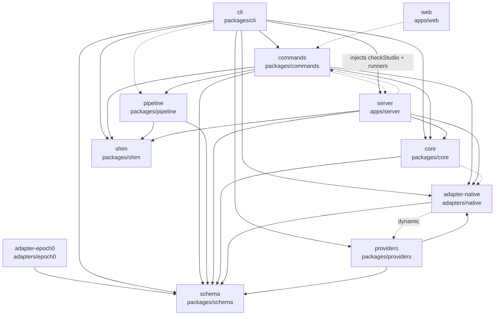
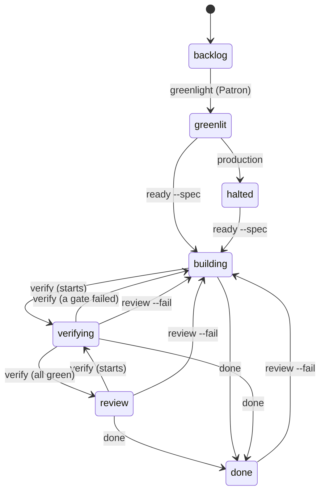
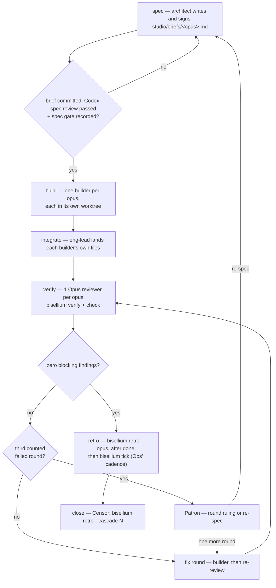
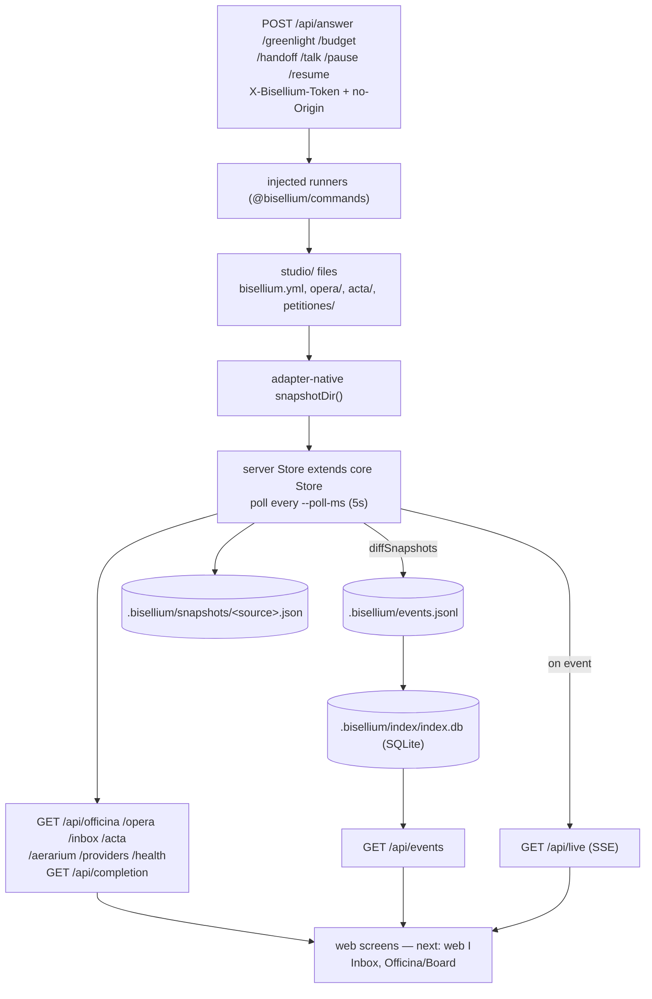
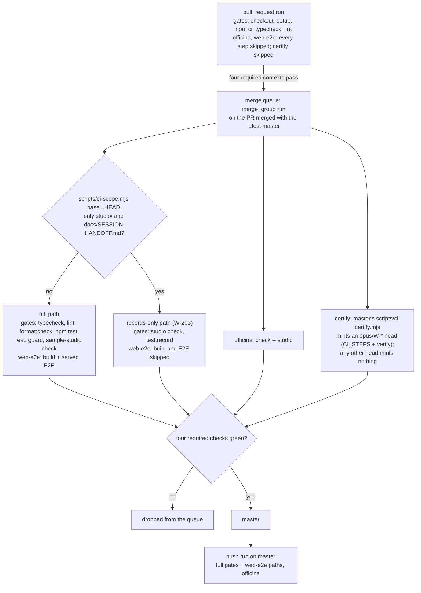

# Architecture

Five maps of Bisellium as it stands after W-205 (2026-10-10): what depends on what, how
an opus moves, how a cascade runs, how a studio's files reach a screen, and how
a change reaches master.
A map, not a spec — the contracts live in `docs/ADOPTION.md` and the leges.

## 1. Packages

Regenerated by `scripts/arch-graph.mjs` (`node scripts/arch-graph.mjs .`), which
reads each workspace's `package.json` and scans its own `@bisellium/*` import
specifiers. Paste its stdout over the block below; its stderr reports drift
(declared-but-never-imported, imported-but-undeclared) and is not part of the
diagram.

```mermaid
flowchart TD
  adapter_epoch0["adapter-epoch0<br/>adapters/epoch0"]
  cli["cli<br/>packages/cli"]
  web["web<br/>apps/web"]
  commands["commands<br/>packages/commands"]
  pipeline["pipeline<br/>packages/pipeline"]
  server["server<br/>apps/server"]
  core["core<br/>packages/core"]
  shim["shim<br/>packages/shim"]
  adapter_native["adapter-native<br/>adapters/native"]
  providers["providers<br/>packages/providers"]
  schema["schema<br/>packages/schema"]
  adapter_epoch0 --> schema
  cli --> commands
  cli -.-> pipeline
  cli -- "injects checkStudio + runners" --> server
  cli --> core
  cli --> shim
  cli --> adapter_native
  cli --> providers
  cli --> schema
  web -.-> commands
  commands --> pipeline
  commands -.-> server
  commands --> core
  commands --> shim
  commands --> adapter_native
  commands --> schema
  pipeline --> shim
  pipeline --> schema
  server -.-> commands
  server --> core
  server --> shim
  server --> adapter_native
  server --> schema
  core -.-> adapter_native
  core --> schema
  adapter_native -. dynamic .-> providers
  adapter_native --> schema
  providers --> adapter_native
  providers --> schema
```

Solid is a runtime import, dotted a deliberate dynamic `import()`
(`adapter-native` → `providers`, the one edge that would otherwise be a static
ESM cycle), dashed a dev/test-only edge — and the only `cli`↔`server` edge runs
downward: `packages/cli/src/serve.ts` passes `checkStudio` and the seven write
runners into `startServer`, so `apps/server` never imports `@bisellium/cli` or
`@bisellium/commands` at runtime (the cycle W-016 cut).

The script reports no drift today: every declared dependency is imported.
`cli` → `pipeline`, `commands` → `server` and `web` → `commands` are
test-only edges; `apps/server` imports `@bisellium/shim` at runtime.

## 2. Opus lifecycle

```mermaid
stateDiagram-v2
  [*] --> backlog
  backlog --> greenlit: greenlight (Patron)
  greenlit --> building: ready --spec
  building --> verifying: verify (starts)
  review --> verifying: verify (starts)
  verifying --> review: verify (all green)
  verifying --> building: verify (a gate failed)
  review --> done: done
  building --> done: done
  verifying --> done: done
  verifying --> building: review --fail
  review --> building: review --fail
  done --> building: review --fail
  greenlit --> halted: production
  halted --> building: ready --spec
```

Six commands write a state id — `greenlight` (backlog only), `ready` (from
`greenlit` or `halted`, and it refuses without a spec), `verify` (below),
`done` (from `building`, `verifying` or `review`), `review --fail`'s reopen edge
back to `building` from `verifying`, `review` or `done` (it emits its own
`workflow.state_changed`; it refuses a verdict log whose failure `verdict` reconciled to passed, W-126), and `halt` from every non-done state. `ready`
records the first `start`, and where `bisellium.yml` declares `brief_behaviour_limit` refuses a brief that fails admission (W-127, shared with `check`'s `brief.admission`; since W-161 that includes a brief with no `## Input domain` section naming, per record read, its valid domain and the one function that rejects the rest, failing closed); `done` records `end`; reopening clears `end` but
retains `start`. The same timestamp is emitted with the transition.

`verify` records the verifying and review stages as they run (W-129, D-034),
but only for the checkout's own tree: the run certifies this checkout's `HEAD`
(no `--commit`, no `ci --ref`) and `--repo` is this checkout's top level. It
writes `verifying` before the pipeline runs (from `building` or `review`), and
when it ends `building` (an automated gate failed) or `review` (this run's
automated results all passed and certify the tree it computed, every other
agent gate is passed, the opus is not `kind: ui`, and no failed review is
provably of the same tree). Each write is a compare-and-set against the fresh
record and emits `workflow.state_changed`. Anywhere else, `verify` writes gate
records exactly as before and never touches `state`. A killed `verify` leaves
`verifying`; the next one simply continues. `adapters/native` names
production's magister as halt's actor, and every state but `done` may halt
(drawn once, from `greenlit`, rather than six times).

Before the readiness/completion writers mutate a native opus they call the
shared `packages/commands/src/opus-model.ts` policy. It narrows native kinds,
titles, hierarchy and dates and, for UI work, establishes design-seat input,
the effective `served-e2e` gate (which also carries a screenshot manifest
file the policy re-verifies against the PNGs on disk), sole-censor citation
and Patron rulings. The pipeline seam carries per-gate environment
(`PipelineRunOpts.commandEnv`), supplied by `verify`, which owns the reserved
gate id, so only that gate learns the opus and officina it runs for.
`check` translates the same structured problems to rule findings; `verify`
uses the same effective-gate and protected-record predicates. The seam is
read-only, keeping command writers and validation from becoming competing
sources of truth.

## 3. Cascade

```mermaid
flowchart TD
  spec["spec — architect writes and signs studio/briefs/&lt;opus&gt;.md"]
  gate1{"brief committed, Codex spec review passed<br/>+ spec gate recorded?"}
  build["build — one builder per opus,<br/>each in its own worktree"]
  integrate["integrate — eng-lead lands each builder's own files"]
  verify["verify — 1 Opus reviewer per opus<br/>bisellium verify + check"]
  gate2{"zero blocking findings?"}
  cap{"third counted<br/>failed round?"}
  patron["Patron — round ruling or re-spec"]
  fix["fix round — builder, then re-review"]
  retro["retro — bisellium retro --opus, after done,<br/>then bisellium tick (Ops' cadence)"]
  close["close — Censor: bisellium retro --cascade N"]
  spec --> gate1
  gate1 -- no --> spec
  gate1 -- yes --> build
  build --> integrate --> verify --> gate2
  gate2 -- no --> cap
  cap -- no --> fix
  cap -- yes --> patron
  patron -- "one more round" --> fix
  patron -- re-spec --> spec
  fix --> verify
  gate2 -- yes --> retro --> close
```

Four phases are fixed in `cascades/cascade.js` (`spec → build → verify → close`)
and sized by `cascades/sizing.json` (2 opera, 1 reviewer per opus, 1
mutation-tested opus) — integration and the fix rounds are eng-lead practice
inside `build`/`verify`, not phases of their own. The two gates are what actually
stop a cascade: no opus enters `building` without a committed brief and a passed
`spec` gate (Design lex §1, `check`'s `state.building.spec`), and no cascade
closes with a blocking finding outstanding.

`next` adds three stops around them, each keyed in `bisellium.yml` and absent
by default. With `spec_reviewer`, no `branch` is named until one Codex review
by that seat has passed after the architect's newest `verdict --phase spec`
signature of the current brief blob (W-162, D-046). After a third counted
failed build-review round (security-only rounds do not count, D-044), `next`
holds for the Patron with a recommendation; a Patron decision attached by
`amend --round-ruling` buys exactly one more round (W-167). Once an opus is
`done` and owes a retro under the `retro` key, `retro` is its next rung, and no
other opus branches until `retro --opus` has filed every recorded finding as a
lesson with a named fix or as "not a lesson" (W-137, D-039).

Builder isolation is the hard rule around the build phase: a worktree per
builder, or a commit of its own files before the Censor runs, because a
verifier's result is void if the tree moved under it (engineering lex §2).

W-125 makes that boundary executable: builder-class `run` bypasses the
generic `WorktreeProvider` and invokes the host-owned runner. The producer
leases the owning branch, creates an independent disposable clone, mounts it
inside outer PID/user/mount/network isolation, and exposes Git only through a
branch/index broker. The broker's transport is a pair of host-created named
pipes in the read-only `/control` mount (W-132, `scripts/git-broker.mjs`; no
socket), and the cell's `git` is the committed `scripts/git-cell-client.mjs`.
The child runtime has an exact credential-free
environment and no external egress. Clean owned commits cross back through a
quarantined, compare-and-swap export; the runtime and descendants are gone
before immutable host tooling recomputes reds and gates. A host completion
receipt binds those results to the final SOURCE tree. Each red entry binds
both the SOURCE tree its log claims and the commit actually replayed
(`replayedTree`); after a rebase moved the claim, that commit is the unique
source-free commit that introduced the log's own bytes (W-134), which the
review gate re-derives from the branch rather than trusting. Since W-166, a
brief that carries `Red order: one at a time` has `red` run the earlier
behaviours' recorded commands first, on the same tree, so a red certifies the
tree its brief names.

The lifecycle review edge is now guarded by that receipt. Both pass and fail
call the same read-only admission seam before evidence parsing or mutation;
there is still one independent censor and no automatic review transition.

## 4. Console read path

```mermaid
flowchart TD
  files["studio/ files<br/>bisellium.yml, opera/, acta/, petitiones/"]
  snap["adapter-native snapshotDir()"]
  store["server Store extends core Store<br/>poll every --poll-ms (5s)"]
  log[(".bisellium/events.jsonl")]
  snaps[(".bisellium/snapshots/&lt;source&gt;.json")]
  idx[(".bisellium/index/index.db (SQLite)")]
  reads["GET /api/officina /opera /inbox /acta<br/>/aerarium /providers /health<br/>GET /api/completion"]
  events["GET /api/events"]
  live["GET /api/live (SSE)"]
  posts["POST /api/answer /greenlight /budget<br/>/handoff /talk /pause /resume<br/>X-Bisellium-Token + no-Origin"]
  runners["injected runners (@bisellium/commands)"]
  web["web screens — next: web I<br/>Inbox, Officina/Board"]
  files --> snap --> store
  store -- "diffSnapshots" --> log
  store --> snaps
  log --> idx
  idx --> events
  store --> reads
  store -- "on event" --> live
  reads --> web
  events --> web
  live --> web
  posts --> runners --> files
```

One direction of truth: the studio's files are the state, `snapshotDir()` reads
them into a Snapshot, the core Store diffs consecutive snapshots into the
append-only `events.jsonl` and folds each new event into the SQLite index —
`/api/events` is answered from that index, the other GETs re-read the files
through `adapter-native` on every call (no cache to invalidate), and the POSTs
never write directly: they call the runners `serve.ts` injected, which edit the
files the next poll picks up.

## 5. CI and the merge queue

```mermaid
flowchart TD
  pr["pull_request run<br/>gates: checkout, setup, npm ci, typecheck, lint<br/>officina, web-e2e: every step skipped; certify skipped"]
  queue["merge queue: merge_group run<br/>on the PR merged with the latest master"]
  scope{"scripts/ci-scope.mjs base...HEAD:<br/>only studio/ and docs/SESSION-HANDOFF.md?"}
  full["full path<br/>gates: typecheck, lint, format:check, npm test,<br/>read guard, sample-studio check<br/>web-e2e: build + served E2E"]
  records["records-only path (W-203)<br/>gates: studio check, test:record<br/>web-e2e: build and E2E skipped"]
  officina["officina: check -- studio"]
  certify["certify: master's scripts/ci-certify.mjs<br/>mints an opus/W-* head (CI_STEPS + verify);<br/>any other head mints nothing"]
  green{"four required checks green?"}
  dropped["dropped from the queue"]
  master["master"]
  push["push run on master<br/>full gates + web-e2e paths, officina"]
  pr -- "four required contexts pass" --> queue
  queue --> scope
  scope -- no --> full
  scope -- yes --> records
  queue --> officina
  queue --> certify
  full --> green
  records --> green
  officina --> green
  certify --> green
  green -- no --> dropped
  green -- yes --> master --> push
```

`.github/workflows/ci.yml` runs the heavy steps once per merge, in the merge
queue (W-205): the `merge_group` run on the merge-group commit carries the full
suite, the studio check, the build and served E2E and `certify`'s mint, and the
`pull_request` run only reports the four required contexts (`gates`,
`officina`, `web-e2e`, `certify`, ruleset `master_protection`) so the PR can be
enqueued, with typecheck and lint as an early signal. `officina` and `web-e2e`
skip every step rather than the whole job, because a job skipped by its own
`if` would not count toward `next`'s `MIN_CHECKS` (`integrate.ts`). In a merge
group, `gates` and `web-e2e` classify the delta against the group's base with
`recordOnly` (`scripts/ci-scope.mjs`): a delta touching only `studio/` and
`docs/SESSION-HANDOFF.md` takes W-203's records-only path; an empty, mixed or
unreadable delta takes the full one. The post-merge `push` runs the full path
for either kind. The light pull-request run is sound only while
`master_protection` requires the merge queue (ADOPTION.md, Merge queue). On a
`push` or a source-change group, `gates` is `CI_STEPS` minus the studio check
and `officina` is that check alone; `scripts/ci-workflow.test.mjs` fails when
they drift from `bisellium ci`.

This pipeline belongs to the Ops collegium (D-055, W-208's PR A):
`studio/bisellium.yml` declares `ops` with magister seat `ops-lead`
(`claude-opus-5-5`) and `studio/leges/ops.md`, which owns CI, the merge queue,
receipts, `verify`, flakes and the host runners. Its cadence is the production
lex's ladder step 7, which runs `tick` once per opus after the retro.

## Seams

- `createNextRecord` (`@bisellium/commands/ids.js`) — the one sequential-id
  seam for `W-*`, `P-*`, and `L-*`: it combines exact local filenames with
  every local and remote-tracking ref, then reserves the rendered record by
  exclusive create. Git failure warns and degrades to local records; it never
  fetches.
- `openLessons` (`@bisellium/commands/lessons.js`) — the one reader of "open"
  lesson classes (W-085): ranked, attributed to collegia, never throws.
  `buildContext` carries them as `## Open lessons`; `check` knows the
  `context_open_lessons` default. `commands` already depends on adapter-native.
- `opus-model` (`@bisellium/commands/opus-model.js`) — the read-only native
  work-model seam shared by `check`, lifecycle/verdict writers and `verify`:
  containment, hierarchy/dates, UI policy/effective gates, design digests and
  W-096's pinned-baseline comparison return structured problems but never
  mutate an officina.
- `StartServerOptions.checkStudio` / `.runners` — the injection that keeps
  `apps/server` free of `@bisellium/cli` (§1).
- `MergePipeline` (`@bisellium/pipeline`) — `verify` runs gates through it, so a
  merge-blocking pipeline is a drop-in for the local runner.
- `WorktreeProvider` / `HarnessProfile` (`@bisellium/shim`) — where a builder
  runs, and what drives it. Builder-class execution uses the stricter private
  `builder-run`/host-runner seam instead of this generic provider.
- `bisellium next` (`packages/cli/src/next.ts`, `integrate.ts`) — the cascade
  ladder derived from evidence (W-124), thirteen rungs `STEPS` from
  `greenlight` to `checkpoint` with `retro` after `done` (W-137). `integrate.ts` owns the `gh`/`git` PR
  rungs (`pr`, `merge`, `cleanup`), which replaced the retired PR scripts;
  `fetchTrunk` fast-forwards a clean checked-out `master` to the reviewed merge
  commit only (never the origin tip, and never from the `pr` rung), and stops
  before the tree on a Patron path (`.claude/`, `.github/`). The architect's spec verdict
  is written in the main checkout before `opus/<id>` exists: the `spec` rung
  commits it onto `spec/<id>` and lands that head through a PR; the `done` rung
  names `verify`, then commits the record, the certificates and the checkpoint
  docs onto `chore/done-<id>` and lands that head the same way (W-141).
  Every dispatch order also carries a `boot:` line (the sella's `bisellium
  context` command, W-085) for a harness that cannot run it.
  `trunkContainsMerge` (`@bisellium/commands/trunk.js`) is the
  one "is this merge in the local trunk" predicate, in `commands` so a `done`
  refusal can import it without a cli-to-commands cycle. No workspace edge is
  added (§1 is unchanged). `done` (W-123) reaches the same predicate through an
  injected reader: `integrate.ts`'s `mergeRefusal`, passed by `done`, `close` and
  `next` to `runDone`, which asks it only when `integration.pr.required` is set.
- The ladder's one-reader seams, each refusing malformed input where it reads
  it so `next` holds and names the cause: `readSpecReviewer` (`next.ts`,
  W-162); `readBuildReviewConfig` / `readBuildRounds`
  (`@bisellium/commands/verdict.js`, W-167), shared by `next` and `amend
  --round-ruling`; `owedRetros` (`packages/cli/src/retro.ts`, W-137), shared by
  `next` and `check`; `readBriefAdmission`
  (`@bisellium/commands/brief-admission.js`), shared by `ready`, `check` and
  `next`'s spec-review order.
- `instant` (`@bisellium/schema`) — the one strict record-date parser (W-163,
  moved from cli so core, server and commands can use it), with
  `readContainedRegularFile` (`opus-model.js`) and `requireRealDirectory`
  (`ids.js`) for officina reads and writes. `containment.test.ts`'s census
  (inventories C and D) fails `npm test` on any raw date parse or officina file
  access outside them that is not listed with a reason.
- `admitCurrentRunReceipt` (`@bisellium/commands/builder-run`) — the shared
  current-SOURCE host-completion predicate used before either review outcome.
- `SnapshotAdapter` (`adapters/native`, `adapters/epoch0`) — the only thing that
  knows a studio's file layout.
- `workflow.*` (`@bisellium/schema`) — the wire vocabulary every layer shares.

**Planned, not yet built** (D-049, W-185, greenlit): records are checked once,
at load. One loader per record type (manifest, opus, decision, lesson, verdict
and red logs) in `@bisellium/schema` refuses a malformed record where it is
read; every other reader receives only checked data, and a census fails the
build on a raw record read outside the loaders. Until it lands, the one-reader
seams above validate per record at their own read sites.

**Planned, not yet built** (W-208, greenlit; `studio/briefs/W-208.md`): the
pipeline opera move under Ops. `amend <opus> --collegium <id>` refuses, before
any write, an id that fails `ID_RE`, is not declared in the manifest's
`collegia`, or is the record's current collegium; `scripts/ops-moves.mjs`
makes the moves only when no `opus/<id>` branch exists locally or on `origin`,
in a records PR after W-208 merges.

**Planned, not yet built** (W-209, in build on `opus/W-209`, not merged):
checkpoint pages count as records. The HTML pages directly in
`docs/design/dossier/` join `recordOnly`, so a done or retro PR that rebuilds
them takes the records-only path in §5. Their half in `source_excludes`
already landed (PR 401), so the pages no longer move a certificate.
